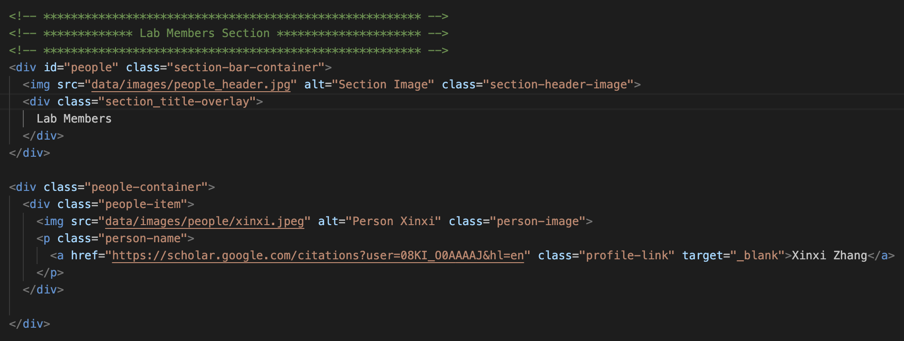
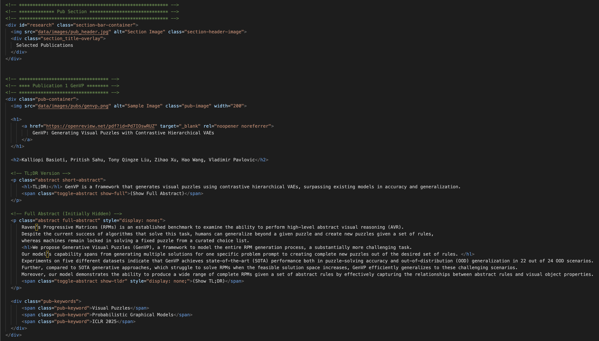

# SEQAM WEB GUIDE

**Updating the website mainly involves**:
- **Editing the HTML files** (`index.html`).
- **Uploading images** to the `data/images/` folder.

**You usually do NOT need to modify**:
- **CSS files** (`style.css`).
- **JavaScript files** (`script.js`).

### Table of Contents
- [Add New Members](#add-new-members)
- [Add New Publications](#add-new-publications)


## Add New Members
### 1. Upload the Image
- Upload a square image of the new member to the directory: `data/images/people/` (e.g. `data/images/people/xinxi.jpeg`)

### 2. Locate the Member block
- Locate the Member blockin `index.html` (can be done by searching the text `Lab Members Section` in the `index.html`)


### 3. Add a New Member Block
- Insert a new `people-item` block inside the `people-container`, here's the Example code:
```html
    <!-- ******** Example Member ********** -->
    <div class="people-item">
      
      <p class="person-name">
        <a href="your personal website or google sholar page if you don't have one" class="profile-link" target="_blank">your_name</a>
      </p>
    </div>
```


## Add New Publications
### 1. Upload the Cover Image for the paper
- Upload the cover image of the new paper to the directory: `data/images/pubs/` (e.g. `data/images/people/genvp.png`)

### 2. Locate the Publication block
- Locate the Member blockin `index.html` (can be done by searching the text `Pub Section in the `index.html`)


### 3. Add a New Publication Block
- Add a new `pub-container` block after the previous paper's `pub-container`, here's the Example code:
```html
  <!-- ********************************* -->
  <!-- **** Publication id Paper_Name ******** -->
  <!-- ********************************* -->
  <div class="pub-container">
    
    
    <h1>
        <a href="paper link" target="_blank" rel="noopener noreferrer">
          Full Paper Name
        </a>
    </h1>
    
    <h2>Author 1, Author 2, Author 3, Author 4 ....</h2>
    
    <!-- TL;DR Version -->
    <p class="abstract short-abstract">
        <hl>TL;DR:</hl> A short description of the work
        <span class="toggle-abstract show-full">(Show Full Abstract)</span>
    </p>

    <!-- Full Abstract (Initially Hidden) -->
    <p class="abstract full-abstract" style="display: none;">
      The full abstract of the work, if you want to highlight some text you can use
      <hl>The text you want to highlight</hl> The rest of the abstract.
        <span class="toggle-abstract show-tldr" style="display: none;">(Show TL;DR)</span>
    </p>

    <div class="pub-keywords">
        <span class="pub-keyword">Key word 1 like diffusion models</span>
        <span class="pub-keyword">Key word ....</span>
        <span class="pub-keyword">Key word you can also put the conference name that the paper accetped to to the keyword</span>
    </div>
  </div>
```
